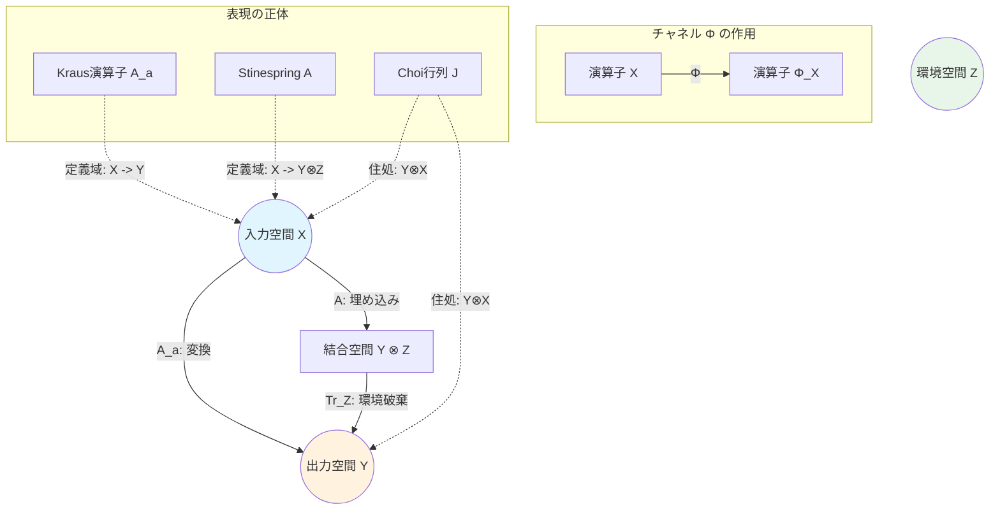

# 量子チャネルにおける空間と表現の整理

量子情報の学習において、$\mathcal{X}, \mathcal{Y}, \mathcal{Z}$ といった空間や、それらの上の写像が多数登場して混乱しやすい部分を整理しました。

## 1. 登場人物（3つの空間）

まず、舞台となる「空間（ヒルベルト空間）」を明確にしましょう。これらはすべて複素ベクトル空間（$\mathbb{C}^n$）です。

| 記号 | 空間の名前 | 次元 | 役割 | イメージ |
| :--- | :--- | :--- | :--- | :--- |
| **$\mathcal{X}$** | **入力空間** | $d_{\mathcal{X}}$ | チャネルに入れる前の量子系の世界 | **過去** (Pre-process) |
| **$\mathcal{Y}$** | **出力空間** | $d_{\mathcal{Y}}$ | チャネルから出てきた後の量子系の世界 | **現在** (Post-process) |
| **$\mathcal{Z}$** | **環境空間** | $d_{\mathcal{Z}}$ | 相互作用するが、最後は見えなくなる世界 | **舞台裏** (Hidden) |

---

## 2. 「状態」と「チャネル」の違い

ここで最も重要なのは、「ベクトル」を扱うのか、「演算子（行列）」を扱うのかの区別です。

*   **ベクトル ($v \in \mathcal{X}$)**: 純粋状態のブラケット表現 $|\psi\rangle$。
*   **演算子 ($X \in \mathrm{L}(\mathcal{X})$)**: 密度行列 $\rho$ や観測量。行列サイズは $d_{\mathcal{X}} \times d_{\mathcal{X}}$。
*   **チャネル ($\Phi$)**: **演算子を演算子に移す写像**（Superoperator）。

$$ \text{入力演算子 } X \xrightarrow{\Phi} \text{出力演算子 } \Phi(X) $$
$$ (\mathcal{X} \text{上の行列}) \longrightarrow (\mathcal{Y} \text{上の行列}) $$

---

## 3. 4つの表現と「住んでいる世界」

チャネル $\Phi$ は抽象的な存在ですが、計算するために4つの具体的な「分身（表現）」を持ちます。それぞれの分身がどの空間で定義されているかが混乱のポイントです。

### ① Kraus（クラウス）表現： $A_a$
*   **式**: $\Phi(X) = \sum A_a X B_a^*$
*   **住んでいる世界**: $\mathrm{L}(\mathcal{X}, \mathcal{Y})$ （$\mathcal{X}$ から $\mathcal{Y}$ への線形写像）
*   **行列サイズ**: $d_{\mathcal{Y}} \times d_{\mathcal{X}}$ （長方形の行列）
*   **直観**: 「入力を出力へ変換するいくつかのパターンの重ね合わせ」。
    *   ベクトル $|\psi\rangle$ に $A_a$ を掛けると、$A_a |\psi\rangle$ という $\mathcal{Y}$ 空間のベクトルになります。

### ② Stinespring（スタインスプリング）表現： $A$ （等長写像）
*   **式**: $\Phi(X) = \mathrm{Tr}_{\mathcal{Z}}(A X A^*)$
*   **住んでいる世界**: $\mathrm{L}(\mathcal{X}, \mathcal{Y} \otimes \mathcal{Z})$ （$\mathcal{X}$ から **結合系** $\mathcal{Y} \otimes \mathcal{Z}$ への写像）
*   **行列サイズ**: $(d_{\mathcal{Y}} d_{\mathcal{Z}}) \times d_{\mathcal{X}}$ （非常に縦長の行列）
*   **直観**: 「環境 $\mathcal{Z}$ を含めた大きな世界への埋め込み」。
    *   入力 $|\psi\rangle$ を、出力と環境がエンタングルした状態 $A|\psi\rangle$ に一度に移します。
    *   その後、$\text{Tr}_{\mathcal{Z}}$ で環境 $\mathcal{Z}$ を捨てる（無視する）ことで、$\mathcal{Y}$ だけの現象に戻します。

### ③ Natural（自然）表現： $K(\Phi)$
*   **式**: $\mathrm{vec}(\Phi(X)) = K(\Phi) \mathrm{vec}(X)$
*   **住んでいる世界**: $\mathrm{L}(\mathcal{X} \otimes \mathcal{X}, \mathcal{Y} \otimes \mathcal{Y})$ のようなもの
    *   正確には $d_{\mathcal{Y}}^2 \times d_{\mathcal{X}}^2$ の巨大行列。
*   **直観**: 「行列を行列に移す計算を、単なる 行列×ベクトル の計算にするための表現」。コンピュータでの数値計算用。

### ④ Choi（チョイ）表現： $J(\Phi)$
*   **式**: $J(\Phi) = (\Phi \otimes \mathbb{I})(|\Gamma\rangle\langle\Gamma|)$
*   **住んでいる世界**: $\mathrm{L}(\mathcal{Y} \otimes \mathcal{X})$ （出力と入力の**テンソル積空間**上の演算子）
*   **行列サイズ**: $(d_{\mathcal{Y}} d_{\mathcal{X}}) \times (d_{\mathcal{Y}} d_{\mathcal{X}})$
*   **直観**: 「チャネルの全情報を1枚の写真（量子状態）に焼き付けたもの」。
    *   写像（動的なプロセス）を、状態（静的なオブジェクト）として扱えるのが最大の特徴です。
    *   これが「エルミート」や「正定値」であるかどうかで、元のチャネルの性質がわかります。

---

## 4. 空間相関図まとめ

## ひとことで言うと？

*   **$\mathcal{X}, \mathcal{Y}$**: 入口と出口。
*   **$\mathcal{Z}$**: 計算の途中でだけ現れて消える（トレースアウトされる）ゴミ箱のような補助空間。
*   **Kraus**: $\mathcal{X} \to \mathcal{Y}$ のパーツの集まり。
*   **Stinespring**: $\mathcal{X} \to \mathcal{Y} \otimes \mathcal{Z}$ への一発変換。
*   **Choi**: $\mathcal{Y} \otimes \mathcal{X}$ という「入出力の相関」を表す巨大な状態。
